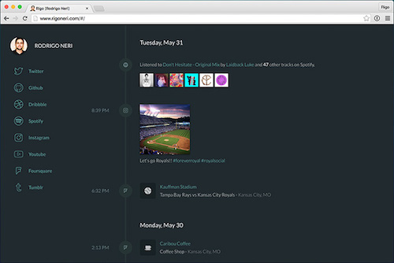
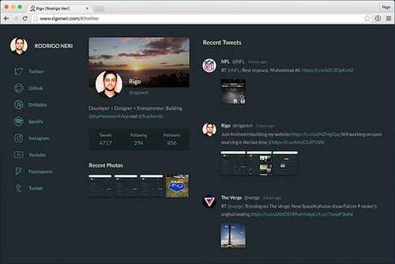
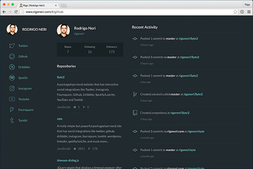
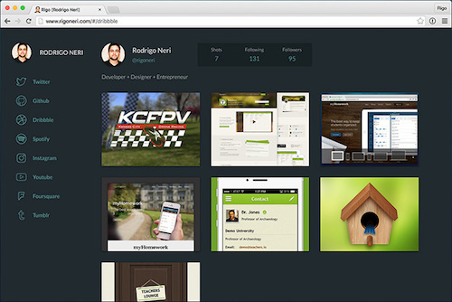
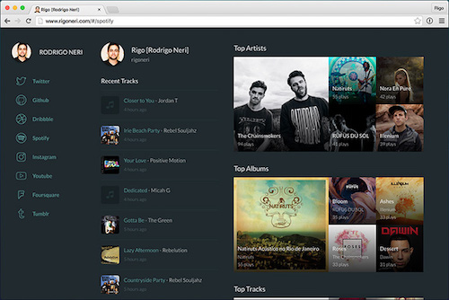
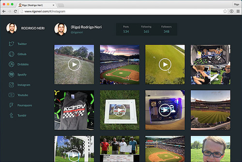
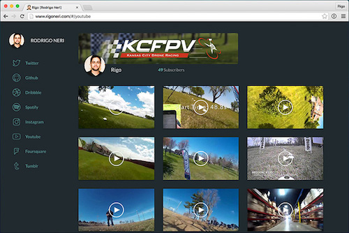
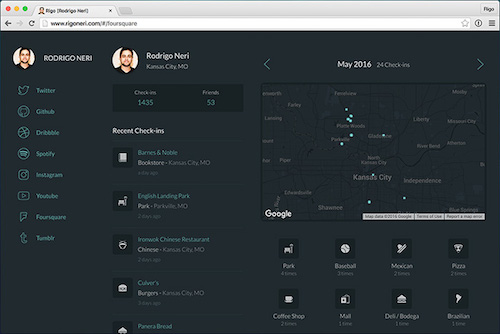
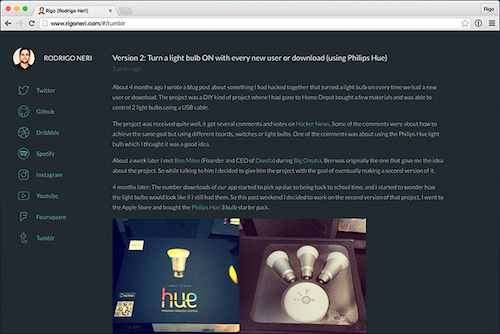
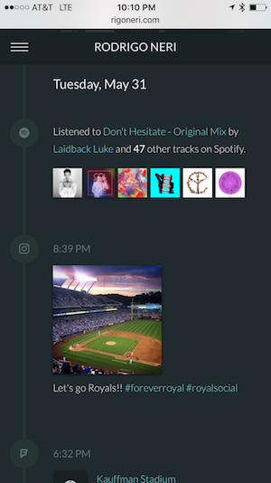

# Syte2

Syte2 is the new and refined version of [Syte](http://github.com/rigoneri/syte), a personal website with interactive social integrations. Syte2 integrates with Twitter, Instagram, Foursquare, Github, Dribbble, Spotify/Last.fm, YouTube and Tumblr. You can see it in action on [my personal site](http://rigoneri.com).

## Stream/Timeline

Syte2 starts of with your social stream. It groups all integrations into a nice and easy to follow timeline.

## Social Integrations

###Twitter

Syte2 integrates with Twitter. Every time you tweet it adds that post to your stream. The Twitter page shows a page similar to your profile.

###Github

Syte2 integrates with Github. Every time you commit something to Github it shows that activity on your stream. The Github page shows your list of public repos and your public activity.

###Dribbble

Syte2 integrates with Dribble. Every time you post a shot to Dribble it shows that shot on your stream. The Dribble page shows a page similar to your Dribbble profile.

###Spotify via Last.fm

Syte2 integrates with Spotify via Last.fm. Every time you listen to a song on Spotify that activity is sent to Last.fm, Syte2 gather and groups that information and adds it to your stream. The Spotify page shows a list of recent tracks you played, as well as your top artists, albums and tracks.

###Instagram

Syte2 integrates with Instagram. Every time you post an image to Instagram it shows that image on your stream. The Instagram page shows a page similar to your profile.

###YouTube

Syte2 integrates with YouTube. Every time you post a video to YouTube it shows that video on your stream. The YouTube page shows a page similar to your YouTube profile.

###Foursquare

Syte2 integrates with Foursquare. Every time you check-in on Foursquare, after a period of time it shows that check-in on your stream. The Foursquare page shows a list of your recent check-ins and a map with a summary of check-ins in the past month.

###Tumblr

Syte2 integrates with Tumblr. Every time you post something to Tumblr it shows that activity on your stream. The Tumblr page shows all your posts.

##Responsive UI

Syte2 is responsive, it scales to any screen size.

##Technologies Used

Syte2 is MEAN! It uses [MongoDB](https://www.mongodb.com/), [Express](http://expressjs.com/), [AngularJS](https://angularjs.org/) and [Node.js](https://nodejs.org).

For development Syte2 uses [LESS](http://lesscss.org) as the CSS pre-processor.

Syte2 also uses a font for [icons](client/app/fonts). I should probably document how I design and build those fonts.

For deployment Syte2 uses [Heroku](http://www.heroku.com/) (since they have a free option) with [mLab MongoDB](https://elements.heroku.com/addons/mongolab) add-on.

##Setup Instructions

`NOTE` The setups instructions are mostly for **Mac** not sure if there are any differences for other OSs.

There are a few steps in order to get Syte2 configured, but don't worry they are pretty easy.

1. [Getting started and initial content changes](docs/start.md)
2. [Running the project locally](docs/running.md)
3. [Setting up Twitter](docs/twitter.md)
4. [Setting up Github](docs/github.md)
5. [Setting up Dribbble](docs/dribbble.md)
6. [Setting up Spotify & Last.fm](docs/lastfm.md)
7. [Setting up Instagram](docs/instagram.md)
8. [Setting up YouTube](docs/youtube.md)
9. [Setting up Foursquare](docs/foursquare.md)
10. [Setting up Tumblr](docs/tumblr.md)

##Deployment Instructions

For now I've only deployed my website to Heroku since it's free to start out. I would love to see it deployed to different services.

* [Heroku deployment instructions](docs/heroku.md)
* [Docker deployment instructions](docks/docker.md)
* AWS deployment instructions (TODO)
* Google Cloud deployment instructions (TODO)

## Contributing

There are plans for several services to be added in the [TODO file](docs/TODO.md). One of these services is a good place to start when looking for ways to help. Also posting/fixing [issues](https://github.com/rigoneri/Syte2/issues) is always helpful.

## Credit

Syte2 was developed by **Rigo** (Rodrigo Neri).

Check out his personal website at <http://rigoneri.com>

Follow him on twitter [@rigoneri](https://twitter.com/rigoneri)

## License

The MIT License

Copyright (c) 2016, Rodrigo Neri <@rigoneri>

Permission is hereby granted, free of charge, to any person obtaining a copy
of this software and associated documentation files (the "Software"), to deal
in the Software without restriction, including without limitation the rights
to use, copy, modify, merge, publish, distribute, sublicense, and/or sell
copies of the Software, and to permit persons to whom the Software is
furnished to do so, subject to the following conditions:

The above copyright notice and this permission notice shall be included in
all copies or substantial portions of the Software.

THE SOFTWARE IS PROVIDED "AS IS", WITHOUT WARRANTY OF ANY KIND, EXPRESS OR
IMPLIED, INCLUDING BUT NOT LIMITED TO THE WARRANTIES OF MERCHANTABILITY,
FITNESS FOR A PARTICULAR PURPOSE AND NONINFRINGEMENT. IN NO EVENT SHALL THE
AUTHORS OR COPYRIGHT HOLDERS BE LIABLE FOR ANY CLAIM, DAMAGES OR OTHER
LIABILITY, WHETHER IN AN ACTION OF CONTRACT, TORT OR OTHERWISE, ARISING FROM,
OUT OF OR IN CONNECTION WITH THE SOFTWARE OR THE USE OR OTHER DEALINGS IN
THE SOFTWARE.
